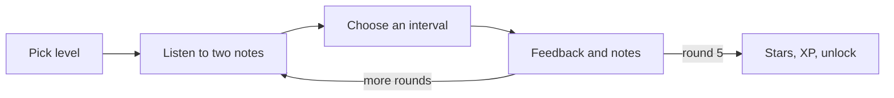

# PR Story: Add a gamified interval trail

## User Problem and Context

The dashboard introduced intervals as the first learning path but offered nothing to do. A learner had to read about intervals without hearing or practising them. This change adds a small, playable listening game so the first path leads somewhere, without accounts or saved data.

## Solution and Design

The "interval trail" is a three-level recognition game. Each level has five rounds in which the learner listens to two notes and names the interval.

- Level 1 separates a unison from an octave.
- Level 2 separates an octave from a perfect fifth.
- Level 3 mixes all three intervals from varying starting notes.

A perfect level earns three stars, one miss two, two misses one. Correct answers give 10 XP that advances a listener rank. A star on a level unlocks the next one. Mistakes cost nothing and levels can be replayed; a replay never lowers earned stars.

Game rules live in a pure reducer (`src/lib/game/interval-game.ts`) with an injected random source, so they are unit tested. Each round plays its two notes automatically from the click that starts the level or the next round, so no extra Listen step is needed; audio creates its context only after a user click, and falls back to a clear message when unavailable. Each round shows only the count, prompt, replay button, and choices; "Show the notes as text" and "Leave level" sit in a collapsed Options disclosure, which provides a non-audio alternative. Progress is kept in memory only, with A4 fixed at 440 Hz. The component uses `useReducer` and local `useState` with no effects or manual memoization.

## Files Changed

| File | Change |
|------|--------|
| `src/lib/music/intervals.ts` | Defines the three intervals and frequency and note-name helpers. |
| `src/lib/game/interval-game.ts` | Holds levels, round generation, scoring, unlocking, ranks, and the reducer. |
| `src/lib/audio/interval-player.ts` | Plays two-note intervals with Web Audio after a user gesture. |
| `src/features/interval-game/IntervalGame.tsx` | Renders levels, rounds, feedback, and the summary. |
| `src/App.tsx` | Owns game state, shows trail progress on the Intervals card, and mounts the game. |
| `src/styles.css` | Adds trail styles, stars, and responsive rules. |
| `src/lib/music/intervals.test.ts`, `src/lib/game/interval-game.test.ts`, `src/lib/audio/interval-player.test.ts`, `src/features/interval-game/IntervalGame.test.tsx`, `src/App.test.tsx` | Cover the maths, rules, audio scheduling, and UI flow. |
| `package.json`, `pnpm-lock.yaml` | Add `@testing-library/user-event` as a dev dependency. |
| `pr_stories/005-interval-trail-game.md` | Documents this change. |

## Verification

### Automated

- **Command:** `task quality`
- **Result:** Passed. Vitest reported 18 tests in 5 files; TypeScript and Vite build succeeded; Markdown validation passed for 18 files (run before this story was added).
- **Command:** `pnpm audit --audit-level high`
- **Result:** No known vulnerabilities found.

### Browser or manual checks

Not performed. Audible playback, layout at mobile widths, and keyboard flow have not been checked in a real browser; tests exercise only the fake `AudioContext` and the unavailable-audio path.

## Security (when relevant)

The feature adds no network calls, storage, or free-text input; state exists only in memory. The one new dependency is a dev-only testing library, and the audit reported no known vulnerabilities.
